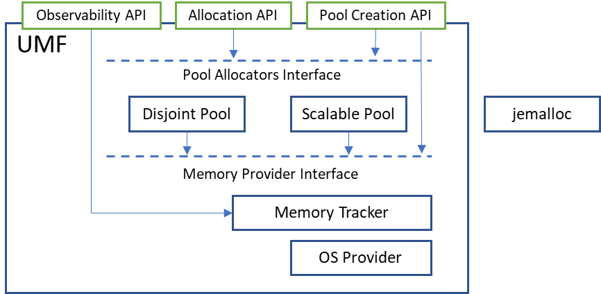

==============
 Introduction
==============

The amount of data that needs to be processed by modern workloads is continuously 
growing. To address the increasing demand, memory subsystem of modern server 
platforms is becoming heterogeneous. For example, High-Bandwidth Memory (HBM) 
addresses throughput needs; the CXL protocol closes the capacity gap and tends 
to improve memory utilization by memory pooling capabilities. Beyond CPU use 
cases, there are GPU accelerators with their own memory on board.

Modern heterogeneous memory platforms present a range of opportunities. At the 
same time, they introduce new challenges that could require software updates to 
fully utilize the HW features. There are two main problems that modern 
applications need to deal with. The first one is appropriate data placement and 
data migration between different types of memory. The second one is how SW 
should leverage different memory topologies.

All applications can be divided into two big groups: enlightened and 
unenlightened. Enlightened applications explicitly manage data allocation 
distribution among memory tiers and further data migration. Unenlightened 
applications do not require any code modifications and rely on underlying 
infrastructure. An underlying infrastructure refers not only to the OS with 
various memory tiering solutions to migrate memory pages between tiers, but 
also middleware: frameworks and libraries.

About UMF
=========

The Unified Memory Framework (`UMF`_) is a library for constructing allocators 
and memory pools. It also contains broadly useful abstractions and utilities 
for memory management. UMF allows users to create and manage multiple memory 
pools characterized by different attributes, allowing certain allocation types 
to be isolated from others and allocated using different hardware resources as 
required.

A memory pool is a combination of a pool allocator instance and a memory 
provider instance along with their properties and allocation policies. 
Specifically, a memory provider is responsible for coarse-grained memory 
allocations, while the pool allocator controls the pool and handles 
fine-grained memory allocations. UMF defines distinct interfaces for both pool 
allocators and memory providers. Users can use pool allocators and memory 
providers provided by UMF or create their own.

The UMF library contains various pool allocators and memory providers but also 
allows for the integration of external ones, giving users the flexibility to 
either use existing solutions or provide their implementations.

**Please note that UMF is a Work-In-Progress!** Read the disclaimer
about that in the `README.md`_ file, before using our project.

The repository for Unified Memory Framework can be found on GitHub:

* `oneapi-src/unified-memory-framework <https://github.com/oneapi-src/unified-memory-framework>`_

==============
 Architecture
==============

Memory Providers
================

A memory provider is an abstraction for coarse (memory page) allocations and 
deallocations of target memory types, such as host CPU, GPU, or CXL memory. 
A single distinct memory provider can efficiently operate the memory of devices 
on the platform or other memory sources such as file-backed or user-provider 
memory.

UMF comes with several bundled memory providers. Please refer to `README.md`_ 
to see a full list of them. There is also a possibility to use externally 
defined memory providers if they implement the UMF interface.

To instantiate a memory provider, user must pass an additional context which 
contains the details about the specific memory target that should be used. This 
would be a NUMA node mask for the OS memory provider, file path for the 
file-backed memory provider, etc. After creation, the memory provider context
can't be changed.

Pool Allocators
===============

A pool allocator is an abstraction over object-level memory management based 
on coarse chunks acquired from the memory provider. It manages the memory pool 
and services fine-grained malloc/free requests. 

Pool allocators can be implemented to be general purpose or to fulfill 
specific use cases. Implementations of the pool allocator interface can 
leverage existing allocators (e.g., jemalloc or oneTBB) or be fully 
customizable. The pool allocator abstraction could contain basic memory 
management interfaces, as well as more complex ones that can be used, for 
example, by the implementation for page monitoring or control (e.g., `madvise`).

UMF comes with several bundled pool allocators. Please refer to `README.md`_ 
to see a full list of them. There is also a possibility to use externally 
defined pool allocators if they implement the UMF interface.

Memory Pools
============

A memory pool consists of a pool allocator and a memory provider instancies 
along with their properties and allocation policies. Memory pools are used by 
the :ref:`allocation API <allocation API>` as a first argument. There is also a possibility to 
retrieve a memory pool from an existing memory pointer that points to a memory 
previously allocated by UMF.

Inter-Process Communication
===========================

The :ref:`IPC API <ipc-api>` allows sharing of memory objects, allocated from UMF memory pools, across different processes. 
Since each process has its own virtual address space, there is no guarantee that the same virtual address will be available when the memory object is shared in a new process. 
There is a set of UMF APIs that makes it easier to share the memory objects with ease.

The :ref:`IPC API <ipc-api>` is based on the concept of IPC handles. An IPC handle is an opaque data structure that is used as a unique identifier to share memory objects across different processes. 
Memory providers are responsible for creating actual IPC handles. As a result, IPC handles are created by the memory provider per coarse grain allocations. 
UMF implementation employs caching for IPC handles returned by the memory provider to avoid creating multiple handles for the same memory region. 
When a client requests an IPC handle for a memory allocated by UMF, UMF does the following:

#. finds the corresponding memory pool.

#. finds corresponding coarse grain allocation (multiple fine grain allocations might reside in a coarse grain memory region returned by the memory provider).

#. checks if the IPC handle for a coarse grain is already cached and returns the cached handle if it exists. Otherwise creates a new IPC handle for the coarse grain allocation.

Not every memory provider can and must support IPC operations. It is up to the memory provider implementation to decide if it supports IPC operations. 
If the corresponding memory provider does not support IPC operations, UMF will return an error when a client requests an IPC handle for a memory object allocated by this memory provider.

==============
 Fundamentals
==============

The following section provides fundamentals of the project. More detailed information can be found in
contributing guide and detailed API pages.

The contribution guide can be found in the repository, in file: `CONTRIBUTING.md`_.

Logging
============

Logging in UMF is handled by logger. There are several levels of logging: *debug*, *info*, *warning*, and *error*.
The level of logging determines what messages will be printed, i.e. the level set to *warning* means all messages at levels *warning* and *error* will be printed.

By default, there is a guarantee that *error* messages are flushed immediately. One can change this behavior to flush on lower-level messages.

Loggers redirect messages to *stdout*, *stderr*, or a file.

By default, only fatal messages are printed. To enable logger you have to set **UMF_LOG** environment variable which have the following syntax for setting logger options::

    UMF_LOG="[level:debug|info|warning|error|fatal];[flush:debug|info|warning|error|fatal];[output:stdout|stderr|file,<path>];[timestamp:yes|no];[pid:yes|no]"

* level - a log level, meaning that only messages from this level and above are printed. Possible values, from the lowest level to the highest one: *debug*, *info*, *warning*, *error*, *fatal*.

* flush - a flush level, meaning that messages at this level and above are guaranteed to be flushed immediately, possible values are the same as above.

* output - indicates where messages should be printed. Possible values are: *stdout*, *stderr* and *file*, when providing a *file* output option, a *<path>* is required.

* timestamp - add a timestamp to log message.

* pid - add thread and process ids to log message.

.. note::
  For output to a file, a path to a file has to be provided after a comma, like in the example above. The path has to exist and should be no longer than 255 characters long. The file will be created if not existing.
  The output parameter is required. All other logger options are optional. The defaults are set when options are not provided in the environment variable.
  Options have to be separated with a semicolon (`;`), option names and their values with a colon (`:`). Additionally, when providing *file* output, the keyword *file* and a path to a file
  have to be separated by a comma (`,`).

An example of an environment variable for setting up logger with logging level set to *info*, flush level set to *warning*, and output set to
the ``out.log`` file::

  UMF_LOG="level:info;flush:warning;output:file,out.log"

An example of an environment variable for setting up logger with logging level set to *warning* and output set to stdout::

  UMF_LOG="level:warning;output:stdout"

.. _UMF: https://github.com/oneapi-src/unified-memory-framework
.. _CONTRIBUTING.md: https://github.com/oneapi-src/unified-memory-framework/blob/main/CONTRIBUTING.md
.. _README.md: https://github.com/oneapi-src/unified-memory-framework/blob/main/README.md
