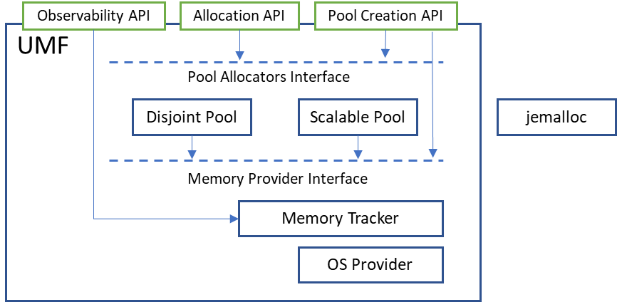

==============
 Introduction
==============

Motivation
==========

The amount of data associated with modern workloads that need to be processed 
by modern workloads is continuously growing. To address the increasing demand 
memory subsystem of modern server platforms is becoming heterogeneous. For 
example, High-Bandwidth Memory (HBM) introduced in Sapphire Rapids addresses 
throughput needs; the emerging CXL protocol closes the capacity gap and tends 
to better memory utilization by memory pooling capabilities. Beyond CPU use 
cases, there are GPU accelerators with their own memory on board.
The opportunities provided by modern heterogeneous memory platforms come 
together with additional challenges. This means that additional software 
changes might be required to fully leverage new HW capabilities. The are two 
main problems that modern applications need to deal with. The first one is 
appropriate data placement and data migration between different types of 
memory. The second one is how SW should deal with different memory topologies.
All applications can be divided into two big groups: enlightened and 
unenlightened. Enlightened applications explicitly manage data allocation 
distribution among memory tiers and further data migration. Unenlightened 
applications do not require any code modifications and rely on underlying 
infrastructure which is in turn enlightened. And underlying infrastructure is 
not only OS with various memory tiering solutions to migrate memory pages 
between tiers, but also middleware: frameworks and libraries. 

==============
 Architecture
==============

The Unified Memory Framework (UMF) is a library for constructing allocators 
and memory pools. It also contains broadly useful abstractions and utilities 
for memory management. UMF allows users to manage multiple memory pools 
characterized by different attributes, allowing certain allocation types to be 
isolated from others and allocated using different hardware resources as 
required. 

A memory pool is a combination of a pool allocator and one or more memory 
targets accessed by memory providers along with their properties and allocation 
policies. Specifically, a memory provider is responsible for coarse-grained 
memory allocations, while the pool allocator controls the pool and handles 
fine-grained memory allocations. UMF provides distinct interfaces for both pool 
allocators and memory providers, allowing integration into various 
applications. 

The UMF library contains various pool allocators and memory providers  but also 
allows for the integration of external ones, giving users the flexibility to 
either use existing solutions or provide their implementations. 

Memory Providers
================

A memory provider is an abstraction for coarse (memory page) allocations and 
deallocations of target memory types, such as host CPU, GPU, or CXL memory. 
A single memory provider kind can efficiently manage the memory operations for 
one or multiple devices within the system or other memory sources like 
file-backed or user-provided memory.

UMF comes with several bundled memory providers. Please refer to the README.md 
to see a full list of them. There is also a possibility to use externally 
defined memory providers if they implement the UMF interface.

To instantiate a memory provider, user must pass an additional context with 
contains the details about the specific memory target that should be used. This 
would be a NUMA node mask for the OS memory provider, file path for the 
file-backed memory provider, etc. After creation, the memory provider context
can't be changed.

Pool Allocators
===============

A pool allocator is an abstraction over object-level memory management based 
on coarse chunks acquired from the memory provider. It manages the memory pool 
and services fine-grained malloc/free requests. 

Pool allocators can be implemented for be general purpose or to fulfill 
specific use cases. Implementations of the pool allocator interface can 
leverage existing allocators (e.g., jemalloc or oneTBB) or be fully 
customizable. The pool allocator abstraction could contain basic memory 
management interfaces, as well as more complex ones that can be used, for 
example, by the implementation for page monitoring or control (e.g., `madvise`).

UMF comes with several bundled memory providers. Please refer to the README.md 
to see a full list of them. There is also a possibility to use externally 
defined pool allocators if they implement the UMF interface.

Memory Pools
============

A Memory pool is a combination of a pool allocator and one or more memory 
targets accessed by memory providers. In UMF the user could either use some 
predefined memory pools or construct user-defined ones using the Pool Creation 
API. 

After construction, memory pools are used by the Allocation API as a first 
argument. There is also a possibility to retrieve a memory pool from an 
existing memory pointer that points to a memory previously allocated by UMF.
